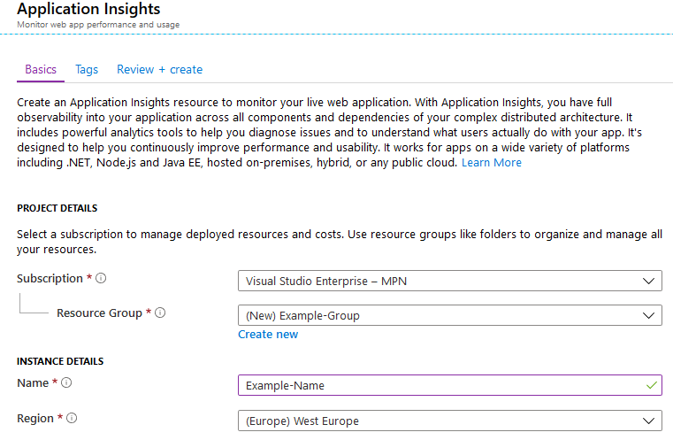
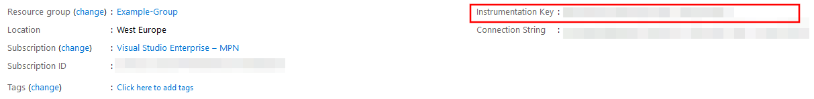

# Application Insights

Application Insights is an extensible Application Performance Management \(APM\) service for web developers on multiple platforms. Use it to monitor your live web application. It will automatically detect performance anomalies. It includes powerful analytics tools to help you diagnose issues and to understand what users actually do with your app.

## Create App Insight for generic auditing

Navigate to **Application Insights**. Click **+ Add** and do the following:

1. Set **Application Type** to **General**  
2. Set **Resource Group** to **Use existing**
3. Click **Create**

Then, copy the field **Instrumentation Key** and send it to [GK Support](https://github.com/realmjoin/realmjoin-gitbooks/tree/3c2250fcc0d712e1b40ac535a1766b57ce01910c/docs/product.support@glueckkanja.com).  
Example value: `a74393bd-2dee-4a10-9df3-66c8c2b2a9ec`

## App Insight - Reporting

To start a reporting, click **Search**

An overview appears, which looks like the following example:

