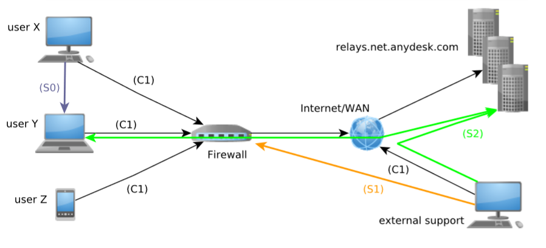

# AnyDesk Cloud Connections

All connections are TCP and encrypted with:

* TLS 1.2
* RSA 2048bit
* AES256
* ECDH
* AEAD

The following graphic shows you a remote session from an **external support** to **user Y:**

<table>
  <thead>
    <tr>
      <th style="text-align:left">Step</th>
      <th style="text-align:left">Explanation</th>
    </tr>
  </thead>
  <tbody>
    <tr>
      <td style="text-align:left">C1</td>
      <td style="text-align:left">Outbound connections to AnyDesk Cloud servers on ports 80, 443 or 6568</td>
    </tr>
    <tr>
      <td style="text-align:left">S0</td>
      <td style="text-align:left">Optional for sessions - if available direct connection between clients
        on port 7070</td>
    </tr>
    <tr>
      <td style="text-align:left">S1</td>
      <td style="text-align:left">A direct connection is tried to port 7070 towards public IP address of <b>user Y</b> known
        by AnyDesk Cloud (also hole punching is tried at the same time).</td>
    </tr>
    <tr>
      <td style="text-align:left">S2</td>
      <td style="text-align:left">
        
If a direct connection (S1) cannot be established, a session over AnyDesk
          Cloud servers (S2) is established:

        <ul>
          <li><b>External support</b> establishes new connection to the AnyDesk Cloud
            server where <b>user Y</b> is connected.</li>
          <li>Data of session (S2) are then transferred:
            <ul>
              <li><b>External support</b> over new connection to AnyDesk Cloud server</li>
              <li><b>User Y</b> over existing connection to AnyDesk Cloud server</li>
            </ul>
          </li>
        </ul>
      </td>
    </tr>
  </tbody>
</table>

