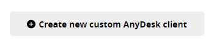
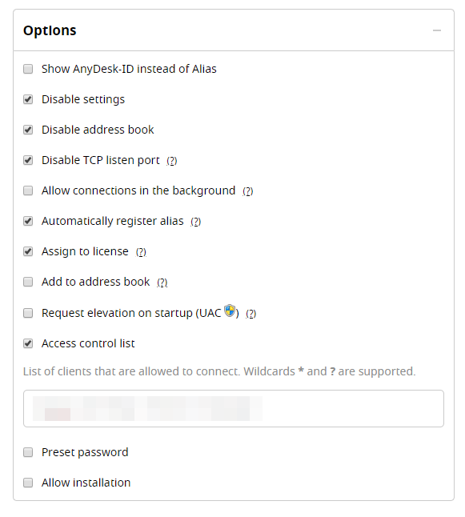
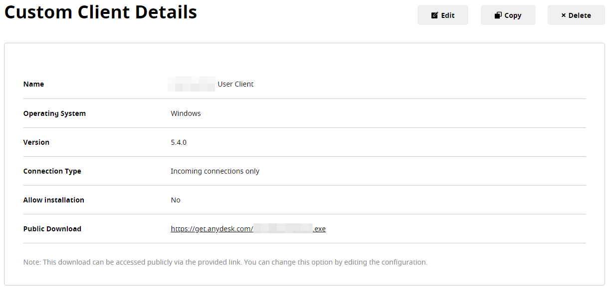
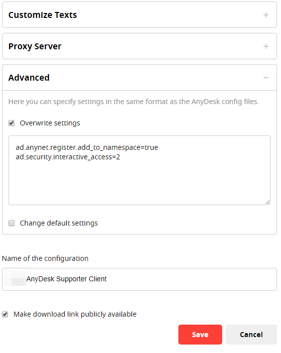

# Glück & Kanja Tasks

If a customer is interested in AnyDesk, the customer will need to send an email to Glück & Kanja \(GK\). GK then will contact AnyDesk to request a license and AnyDesk will send back login credentials. With these credentials, GK can start the deployment of a user client and the deployment of a supporter client.

## AnyDesk User Client Deployment

<table>
  <thead>
    <tr>
      <th style="text-align:left">Task</th>
      <th style="text-align:left">Image</th>
    </tr>
  </thead>
  <tbody>
    <tr>
      <td style="text-align:left">1. Log in to <a href="https://my.anydesk.com/login">AnyDesk </a>(use the
         credentials sent by AnyDesk)</td>
      <td style="text-align:left"></td>
    </tr>
    <tr>
      <td style="text-align:left">2. Navigate to <b>Files</b>
      </td>
      <td style="text-align:left">
        
      </td>
    </tr>
    <tr>
      <td style="text-align:left">3. Then click <b>Create new custom AnyDesk client</b>
      </td>
      <td style="text-align:left">
        
      </td>
    </tr>
    <tr>
      <td style="text-align:left">4. The <b>Customize AnyDesk</b> window appears</td>
      <td style="text-align:left"></td>
    </tr>
    <tr>
      <td style="text-align:left">5. Select <b>Windows</b> as <b>Platform</b>
      </td>
      <td style="text-align:left"></td>
    </tr>
    <tr>
      <td style="text-align:left">6. Next enter a <b>Filename</b> and
         select <b>Incoming connections only</b>
      </td>
      <td style="text-align:left"></td>
    </tr>
    <tr>
      <td style="text-align:left">
        
7. Then select the following <b>Options</b>:
           
        

        <ul>
          <li>Disable settings</li>
          <li>Disable address book</li>
          <li>Disable TCP listen port</li>
          <li>Automatically register alias</li>
          <li>Assign to license</li>
          <li>Access control list
            <ul>
              <li>Enter the namespace of your customer, start with an @.</li>
              <li>For example: @companyname</li>
            </ul>
          </li>
        </ul>
      </td>
      <td style="text-align:left">
        
      </td>
    </tr>
    <tr>
      <td style="text-align:left">
        
8. Click <b>Advanced</b> and set the following settings:

        

        <ul>
          <li>
            
Overwrite settings:

            
ad.features.register_alias=true
               ad.ui.lang=de
               ad.security.tcp_tunnel=false
               
            

          </li>
          <li>
            
Change default settings:

            
ad.ui.cfg_enable_recording=false
               ad.security.sync_clipbrd=false
               ad.security.hear_audio=false
               ad.ui.cfg_enable_audio=false
               ad.security.record_session=false

          </li>
        </ul>
      </td>
      <td style="text-align:left">
        
      </td>
    </tr>
    <tr>
      <td style="text-align:left">9. Next enter a <b>Name of the configuration</b>
      </td>
      <td style="text-align:left"></td>
    </tr>
    <tr>
      <td style="text-align:left">10. Select <b>Make download link publicly avaiblable</b>
      </td>
      <td style="text-align:left"></td>
    </tr>
    <tr>
      <td style="text-align:left">11. When you are done click <b>Save</b>
      </td>
      <td style="text-align:left"></td>
    </tr>
    <tr>
      <td style="text-align:left">12. The <b>Custom Client Details</b> window appears</td>
      <td style="text-align:left">
        
      </td>
    </tr>
    <tr>
      <td style="text-align:left">13. Copy or save the <b>Public Download</b> URL. You have to send this URL
        to your customer. The customer needs this URL for the <b>Group Settings</b>.</td>
      <td
      style="text-align:left"></td>
    </tr>
  </tbody>
</table>## AnyDesk Supporter Client Deployment

<table>
  <thead>
    <tr>
      <th style="text-align:left">Task</th>
      <th style="text-align:left">Image</th>
    </tr>
  </thead>
  <tbody>
    <tr>
      <td style="text-align:left">1. Log in to <a href="https://my.anydesk.com/login">AnyDesk</a>
      </td>
      <td style="text-align:left"></td>
    </tr>
    <tr>
      <td style="text-align:left">2. Navigate to <b>Files</b>
      </td>
      <td style="text-align:left">
        
      </td>
    </tr>
    <tr>
      <td style="text-align:left">3. Then click <b>Create new custom AnyDesk client</b>
      </td>
      <td style="text-align:left">
        
      </td>
    </tr>
    <tr>
      <td style="text-align:left">4. The <b>Customize AnyDesk</b> window appears</td>
      <td style="text-align:left"></td>
    </tr>
    <tr>
      <td style="text-align:left">5. Select <b>Windows MSI</b> as <b>Platform</b>
      </td>
      <td style="text-align:left"></td>
    </tr>
    <tr>
      <td style="text-align:left">
        
6. Next enter a <b>Filename</b> and

        
select <b>Outgoing connections only</b>
        

      </td>
      <td style="text-align:left"></td>
    </tr>
    <tr>
      <td style="text-align:left">
        
7. Select the following <b>Options</b>
        

        
&lt;b&gt;&lt;/b&gt;

        <ul>
          <li>Disable address book</li>
          <li>Disable TCP listen port</li>
          <li>Assign to license</li>
        </ul>
      </td>
      <td style="text-align:left">
        
      </td>
    </tr>
    <tr>
      <td style="text-align:left">
        
8. Click <b>Advanced</b> and set the following settings:

        

        <ul>
          <li>
            
Overwrite settings:

            
ad.anynet.register.add_to_namespace=true ad.security.interactive_access=2

          </li>
        </ul>
        
<b>Note:</b>
        

        
&apos;ad.anynet.register.add_to_namespace=true&apos; ensures that AnyDesk
          creates an alias for the Supporter Client from the customer&apos;s namespace.
          So the User Client recognizes that the Supporter Client access is allowed.U

      </td>
      <td style="text-align:left">
        
      </td>
    </tr>
    <tr>
      <td style="text-align:left">9. Next enter a <b>Name of the configuration</b>
      </td>
      <td style="text-align:left"></td>
    </tr>
    <tr>
      <td style="text-align:left">10. Select <b>Make download link publicly avaiblable</b>
      </td>
      <td style="text-align:left"></td>
    </tr>
    <tr>
      <td style="text-align:left">11. When you are done click <b>Save</b>
      </td>
      <td style="text-align:left"></td>
    </tr>
    <tr>
      <td style="text-align:left">12. The <b>Custom Client Details</b> window appears</td>
      <td style="text-align:left">
        
      </td>
    </tr>
    <tr>
      <td style="text-align:left">13. Copy or save the <b>Public Download</b> URL. You have to send this URL
        to your customer. The customer needs this URL for the <b>AnyDesk Support Client Setup Launcher - Package Definition</b>.</td>
      <td
      style="text-align:left"></td>
    </tr>
  </tbody>
</table>