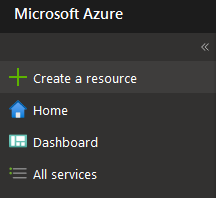
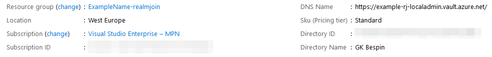

# KeyVault

Cloud applications and services use cryptographic keys and secrets to help keep information secure. Azure Key Vault safeguards these keys and secrets. When you use Key Vault, you can encrypt authentication keys, storage account keys, data encryption keys, .pfx files, and passwords by using keys that are protected by hardware security modules.

## Create KeyVault

The following table shows you the steps for Azure KeyVault Creation:

<table>
  <thead>
    <tr>
      <th style="text-align:left">Task</th>
      <th style="text-align:left">Image</th>
    </tr>
  </thead>
  <tbody>
    <tr>
      <td style="text-align:left">1. Open <a href="https://portal.azure.com">Azure Portal</a>
      </td>
      <td style="text-align:left"></td>
    </tr>
    <tr>
      <td style="text-align:left">2. Start with <b>Create a resource</b>
      </td>
      <td style="text-align:left">
        

        

          
        

      </td>
    </tr>
    <tr>
      <td style="text-align:left">3. Type in <b>Key Vault</b> in the search field</td>
      <td style="text-align:left">
        

        

          
        

      </td>
    </tr>
    <tr>
      <td style="text-align:left">4. On the detail page click <b>Create</b>
      </td>
      <td style="text-align:left"></td>
    </tr>
    <tr>
      <td style="text-align:left">5. Fill out the required fields.
         
         Please make sure to use a distinct naming scheme for the keyvault URL.
         
         For example: <b>rj-[tenant]-[service]</b>
      </td>
      <td style="text-align:left">
        

        

          
        

      </td>
    </tr>
    <tr>
      <td style="text-align:left">6. Click <b>Review + Create</b>
      </td>
      <td style="text-align:left"></td>
    </tr>
    <tr>
      <td style="text-align:left">7. Review your settings and configurations and click <b>Create</b>
      </td>
      <td style="text-align:left"></td>
    </tr>
    <tr>
      <td style="text-align:left">8. Wait for the successful deployment</td>
      <td style="text-align:left"></td>
    </tr>
    <tr>
      <td style="text-align:left">9. Click <b>Go to resource</b>
      </td>
      <td style="text-align:left"></td>
    </tr>
    <tr>
      <td style="text-align:left">10. Navigate to <b>Access policies</b>
      </td>
      <td style="text-align:left">
        

        

          
        

      </td>
    </tr>
    <tr>
      <td style="text-align:left">11. Click <b>Add Access Policies</b>
      </td>
      <td style="text-align:left"></td>
    </tr>
    <tr>
      <td style="text-align:left">12. Select <b>Key, Secret &amp; Certificate Management</b> as template and
        add RealmJoin as <b>Select principal</b>
      </td>
      <td style="text-align:left">
        

        

          
        

      </td>
    </tr>
    <tr>
      <td style="text-align:left">13. Click <b>Key permissions</b>
      </td>
      <td style="text-align:left"></td>
    </tr>
    <tr>
      <td style="text-align:left">14. For <b>Cryptographic Operations</b> add Decrypt, Encrypt, Unwrap Key,
        Wrap Key, Verify and Sign</td>
      <td style="text-align:left">
        

        

          
        

      </td>
    </tr>
    <tr>
      <td style="text-align:left">15. Click <b>Save</b> and then <b>OK</b>
      </td>
      <td style="text-align:left"></td>
    </tr>
    <tr>
      <td style="text-align:left">16. Finally, go to <b>Overview</b> and share the <b>DNS Name</b> with the
        <a
        href="mailto:product.support@glueckkanja.com">Gl&#xFC;ck &amp; Kanja support</a>
      </td>
      <td style="text-align:left">
        

        

          
        

      </td>
    </tr>
    <tr>
      <td style="text-align:left"><b>Example Value</b>: https://example-rj-localadmin.vault.azure.net</td>
      <td
      style="text-align:left"></td>
    </tr>
  </tbody>
</table>## KeyVault Storage of Secrets

RealmJoin will not store the secret in any proprietary storage but instead create an **Azure KeyVault Secret** to store it in a secure and auditable way. The KeyVault API is documented here:

[https://docs.microsoft.com/en-us/rest/api/keyvault/setsecret/setsecret](https://docs.microsoft.com/en-us/rest/api/keyvault/setsecret/setsecret)

The entry in KeyVault will be added with the device name as a key and the plain GUID as the secret value. See the following example screenshot:

