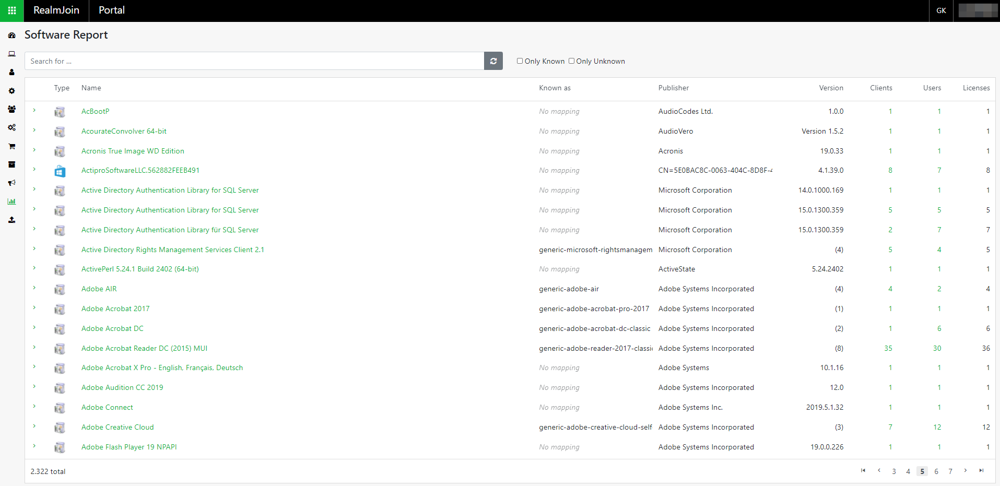
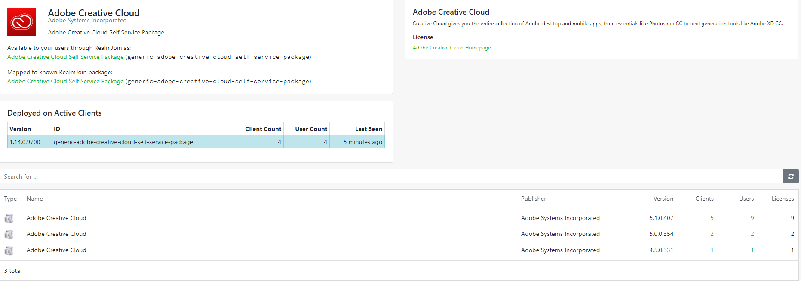

# Software Report

**Software Report** contains an overview of all software that is in use. Additionally you can see which user, group or client is using a software.

### Overview

When you open the menu you will see a complete list of all software in use. This list is sorted alphabetically. The following software attributes are listed:

<table>
  <thead>
    <tr>
      <th style="text-align:left">Attribut</th>
      <th style="text-align:left">Explanation</th>
    </tr>
  </thead>
  <tbody>
    <tr>
      <td style="text-align:left"><b>Type</b>
      </td>
      <td style="text-align:left">
        
There are two in RealmJoin:
           
        

        <ul>
          <li>Windows Installer</li>
          <li>Windows Store</li>
        </ul>
      </td>
    </tr>
    <tr>
      <td style="text-align:left"><b>Known as</b>
      </td>
      <td style="text-align:left">&apos;Known as&apos; corresponds to a RealmJoin package ID. Even if the
        package was not purchased via RealmJoin, RealmJoin still tries to map an
        existing ID to this package.</td>
    </tr>
    <tr>
      <td style="text-align:left"><b>Publisher</b>
      </td>
      <td style="text-align:left">Publisher of the Software</td>
    </tr>
    <tr>
      <td style="text-align:left"><b>Version</b>
      </td>
      <td style="text-align:left">Version of the installed software</td>
    </tr>
    <tr>
      <td style="text-align:left"><b>Clients</b>
      </td>
      <td style="text-align:left">Count of using clients</td>
    </tr>
    <tr>
      <td style="text-align:left"><b>User</b>
      </td>
      <td style="text-align:left">Count of users</td>
    </tr>
    <tr>
      <td style="text-align:left"><b>Licenses</b>
      </td>
      <td style="text-align:left">Count of existing licenses</td>
    </tr>
  </tbody>
</table>

### Details

In this submenu you see the details of a software.

In the upper left corner you can see the name of the software, if it is available through RealmJoin and the corresponding package ID.

**Deployed on Active Clients** shows you the package version and the corresponding ID. You can also see  how many clients \(**Client Count**\) and users \(**User Count**\) use the package. **Last Seen** shows you when RealmJoin last checked Client Count and User Count.

Below 'Deployed on Active Clients' you can see a list of all installed software versions. This list offers the following attributes:

<table>
  <thead>
    <tr>
      <th style="text-align:left">Attribut</th>
      <th style="text-align:left">Explanation</th>
    </tr>
  </thead>
  <tbody>
    <tr>
      <td style="text-align:left"><b>Type</b>
      </td>
      <td style="text-align:left">
        

        
There are two in RealmJoin:
           
        

        <ul>
          <li>Windows Installer</li>
          <li>Windows Store</li>
        </ul>
      </td>
    </tr>
    <tr>
      <td style="text-align:left"><b>Name</b>
      </td>
      <td style="text-align:left">Software name</td>
    </tr>
    <tr>
      <td style="text-align:left"><b>Publisher</b>
      </td>
      <td style="text-align:left">Publisher of the Software</td>
    </tr>
    <tr>
      <td style="text-align:left"><b>Version</b>
      </td>
      <td style="text-align:left">Version of the installed software</td>
    </tr>
    <tr>
      <td style="text-align:left"><b>Clients</b>
      </td>
      <td style="text-align:left">Count of using clients (for more details see <a href="software-report.md#client-report">Client Report</a>)</td>
    </tr>
    <tr>
      <td style="text-align:left"><b>Users</b>
      </td>
      <td style="text-align:left">Count of users (for more details see <a href="software-report.md#users-report">Users Report</a>)</td>
    </tr>
    <tr>
      <td style="text-align:left"><b>Licenses</b>
      </td>
      <td style="text-align:left">Count of existing licenses</td>
    </tr>
  </tbody>
</table>

In the upper right corner is a short description of the software or package.

### Client Report

If you click a number that is listed under 'Client' in the detail view, you will get to the menu **Clients that have \[Software name\] installed.**

The existing list shows the following attributes:

| Attribute | Explanation |
| :--- | :--- |
| **Name \(latest\)** | The latest client name |
| **Primary User** | The primary user of the client |
| **Version \(latest\)** | The latest RealmJoin version |
| **ID** | Client ID number |
| **First Seen** | The first connection to RealmJoin |
| **Last Contact** | The last connection to RealmJoin |
| **Us** | The count of the client's users \(for more details see [Users of a Client](software-report.md#users-of-a-client)\) |

#### Users of a Client

If you select one of the numbers in the **Us** column, you will get an overview of all users of a client:

You will see the following information about each user:

<table>
  <thead>
    <tr>
      <th style="text-align:left">Attribute</th>
      <th style="text-align:left">Explanation</th>
    </tr>
  </thead>
  <tbody>
    <tr>
      <td style="text-align:left"><b>Name</b>
      </td>
      <td style="text-align:left">
        
User name

        <ul>
          <li>Black icon = Primary user</li>
          <li>White icon = Guest user</li>
        </ul>
      </td>
    </tr>
    <tr>
      <td style="text-align:left"><b>ID</b>
      </td>
      <td style="text-align:left">User ID number</td>
    </tr>
    <tr>
      <td style="text-align:left"><b>First Seen</b>
      </td>
      <td style="text-align:left">First connection to RealmJoin</td>
    </tr>
    <tr>
      <td style="text-align:left"><b>Last Contact</b>
      </td>
      <td style="text-align:left">Last connection to RealmJoin</td>
    </tr>
    <tr>
      <td style="text-align:left"><b>Gr</b>
      </td>
      <td style="text-align:left">Count of group memberships of the user</td>
    </tr>
    <tr>
      <td style="text-align:left"><b>Pa</b>
      </td>
      <td style="text-align:left">Count of owning software packages</td>
    </tr>
    <tr>
      <td style="text-align:left"><b>Cl</b>
      </td>
      <td style="text-align:left">Count of owning clients</td>
    </tr>
    <tr>
      <td style="text-align:left"><b>Se</b>
      </td>
      <td style="text-align:left">Count of configured settings</td>
    </tr>
  </tbody>
</table>

### Users Report

If you click a number that is listed under 'User' in the detail view, you will get to the menu **Users that have \[Software name\] installed.**

The existing list shows the following attributes:

| Attribute | Explanation |
| :--- | :--- |
| **Name** | User name |
| **ID** | User ID number |
| **First Seen** | First connection to RealmJoin |
| **Last Contact** | Last connection to RealmJoin |
| **Gr** | Count of group memberships of the user |
| **Pa** | Count of owning software packages |
| **Cl** | Count of owning clients |
| **Se** | Count of configured settings |

