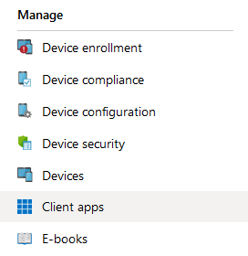
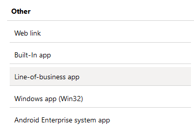
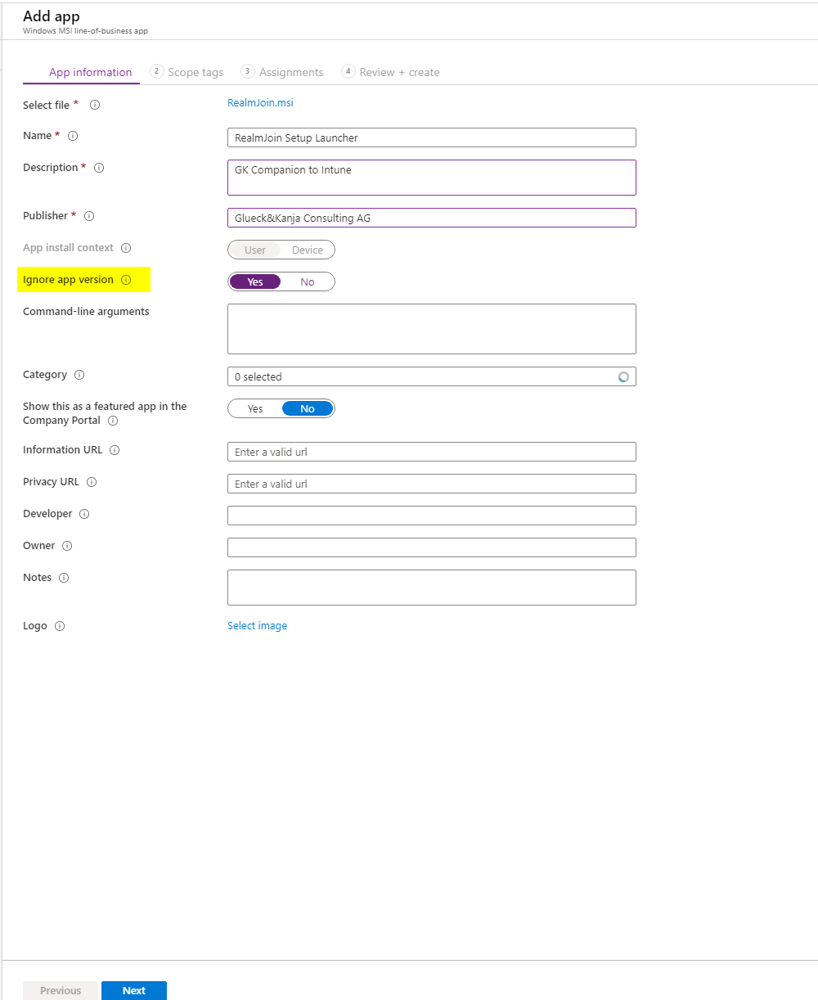

# Install Using Microsoft Intune

RealmJoin has to deploy through Microsoft Intune by deploying the MSI as a Line-of-Business app. The following article is a step-by-step guide to deploy RealmJoin.  

### Azure Intune Portal

Use the following instructions to deploy RealmJoin:

<table>
  <thead>
    <tr>
      <th style="text-align:left">Task</th>
      <th style="text-align:left">Image</th>
    </tr>
  </thead>
  <tbody>
    <tr>
      <td style="text-align:left">1.Log in to your <a href="https://portal.azure.com/">Azure portal</a>
      </td>
      <td style="text-align:left">
        

        

      </td>
    </tr>
    <tr>
      <td style="text-align:left">2. Navigate to <b>Microsoft Intune </b>and select<b> Client apps</b>
      </td>
      <td style="text-align:left">
        

        

          
        

      </td>
    </tr>
    <tr>
      <td style="text-align:left">3. Then select <b>Apps</b> and click <b>+Add</b>
      </td>
      <td style="text-align:left">
        

        

          
        

        

      </td>
    </tr>
    <tr>
      <td style="text-align:left">4. Under <b>Other</b> choose <b>Line-of-business-app </b>and click <b>Select</b>
      </td>
      <td style="text-align:left">
        

        

          
        

      </td>
    </tr>
    <tr>
      <td style="text-align:left">5. Next click <b>Select app package file</b>
      </td>
      <td style="text-align:left"></td>
    </tr>
    <tr>
      <td style="text-align:left">6. As <b>App package file</b> browse for <b>RealmJoin.msi</b> on your device</td>
      <td
      style="text-align:left">
        

        

          
        

        </td>
    </tr>
    <tr>
      <td style="text-align:left">7. Then, click <b>OK</b>
      </td>
      <td style="text-align:left"></td>
    </tr>
    <tr>
      <td style="text-align:left">8. Under <b>App information</b> fill in all required fields and set <b>Ignore app version</b> to <b>Yes</b>
      </td>
      <td style="text-align:left">
        

        

          
        

      </td>
    </tr>
    <tr>
      <td style="text-align:left">9. Under <b>Assignments </b>add groups and users for your RealmJoin app</td>
      <td
      style="text-align:left">
        

        

          
        

        </td>
    </tr>
    <tr>
      <td style="text-align:left">10. Under <b>Review + create</b> check all your settings</td>
      <td style="text-align:left">
        

        

          
        

      </td>
    </tr>
    <tr>
      <td style="text-align:left">11. Finally click <b>Create</b>
      </td>
      <td style="text-align:left"></td>
    </tr>
  </tbody>
</table>
Like any other application in Intune, ReamJoin can be assigned to the desired user groups as \(required\) software. It is not necessary to install additional software on the client devices to run RealmJoin. RealmJoin will be deployed on the client devices on the next Azure sync.


### Windows Defender Exceptions

RealmJoin has worked with the Microsoft Defender Team to be whitelisted from malware detection. Since Defender is using more and more machine learning mechanisms to identify potential threats and RealmJoin has several features like cloud downloaded application installations, RealmJoin might be recognized by **Windows Defender** as a possible threat. 

While this behavior is not certain, it is recommended to implement additional Windows Defender exceptions. Create a new device configuration profile, type **Device restriction**, or edit your existing profile and add the following **Windows Defender Antivirus Exceptions**:

| Defender Exceptions |
| :--- |
| **Files and Folders** |
| `%ProgramFiles%\RealmJoin` |
| **Processes** |
| `%ProgramFiles%\RealmJoin\RealmJoin.exe`  |
| `%ProgramFiles%\RealmJoin\RealmJoinService.exe`  |
| `%ProgramFiles%\RealmJoin\RealmJoinUpdate.exe` |

