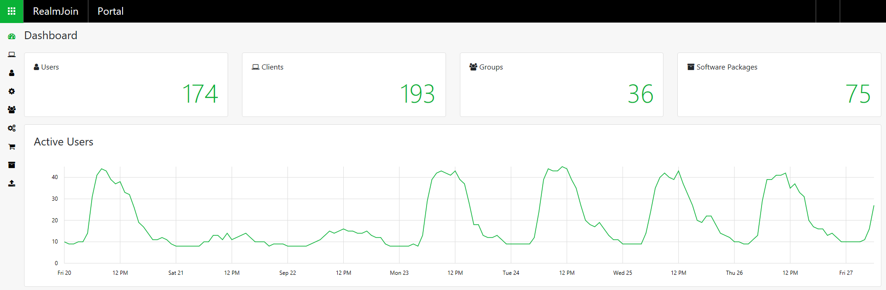

# RealmJoin Portal

Device provisioning and RealmJoin configuration is done with the RealmJoin Portal. Administrative users have access to the RealmJoin Portal. Designed to mirror the style of the new Microsoft administration services, it is the main tool for the management of the RealmJoin clients and users. RealmJoin incorporates the same group based user and policy management experience and uses the Azure AD defined groups as basis for software deployment. 

The default interval for group synchronization between Azure AD and RealmJoin is 15 minutes, while only groups with a defined prefix are taken into consideration. Only groups with at least one assigned user are synchronized \(synchronization interval can be adjusted\).

Click one of these links to get to the RealmJoin Portal:

* [Web application](https://realmjoin-web.azurewebsites.net/)
* [Beta version](https://realmjoin-web-staging.azurewebsites.net/) 

The dashboard provides a quick and beneficial overview. All sections can be accessed by either clicking on the corresponding number or selecting the section in the toolbar on the left.

### RealmJoin Toolbar

As you can see, there are several icons listed in the toolbar. Here is a brief explanation of each icon \(links to more detailed information are provided\).

#### Clients

A click on the Clients icon gives you a transparent overview over all enrolled devices as well as the respective primary user. For more details read our [Clients article](clients.md).

#### Users

The Users icon gives you a list of all users assigned to the tenant. Fore more details read our [Users and User Settings article](users-and-user-settings.md).

#### User Settings

Via the User Settings icon you have the possibility to configure user settings and policies. For more details read our [Users and User Settings article](users-and-user-settings.md).

#### Groups

Via the Groups icon you can see all groups registered in this tenant. For more details read our [Groups and Group Settings article](groups-and-group-settings.md).

#### Group Settings

Via the User Settings icon you have the possibility to configure group settings and policies. For more details read our [Groups and Group Settings article](groups-and-group-settings.md).

#### App Store

This icon takes you to the RealmJoin application store. For more details read our [App Store article](app-store.md).

#### Software Packages

A click on this icon gives you a list of all added packages. For more details read our [Software Packages article](software-packages.md). 

#### Request Packages

If an application is not listed in the App Store, or is in need of customization, a packaging request can be sent to Glück & Kanja. For more details read our [Request Package article](request-package.md).

### Roles in RealmJoin

There are four different roles available for the RealmJoin Portal:

* Administrator
* Auditor
* Supporter
* Software Agent

#### Administrator

A RealmJoin administrator has full rights within the RealmJoin portal.

#### Auditor

An auditor has read-only rights within the RealmJoin portal and has access to all settings and assignments.

#### Software Agent

A software agent can assign software to users and can change it as well and the software agent has can subscribe the RealmJoin app store. Additionally, a software agent has access to users, clients, groups, software and app store. With these role it is not possible to use AnyDesk and LAPS and it is not possible to reassign primary users.

#### Supporter

A supporter can not manage RealmJoin software. A supporter has access to users, clients and groups \(reassign primary users as well\). Furthermore, a supporter has the possibility to use AnyDesk and LAPS.

### 

