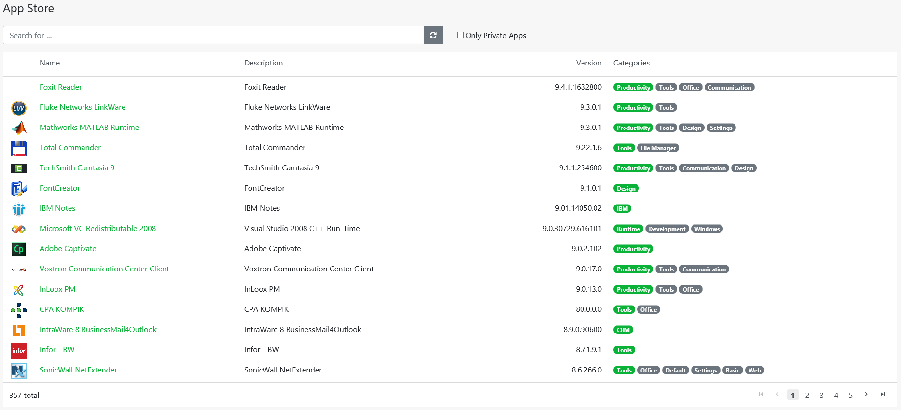
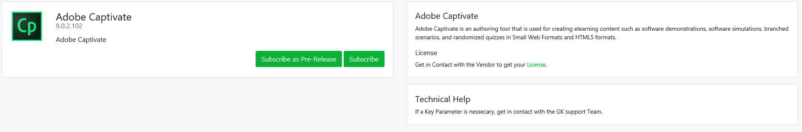

# App Store

Glück & Kanja maintains an ever-expanding library of ready-to-go applications that might instantly be added to the list of available packages and assigned to groups or users. 

Four different attributes are displayed in the App Store:

* App **Name**
* App **Description**
* App **Version**
* App **Categories**

Above the attributes, there is a search bar \(**Search for ...**\). This search compares the input made with each of the attributes and returns suitable results. 

Next to the search bar is the selection field **Only Private Apps**. If you check this box, you will only see the apps that are individually stored for your company in the App Store. These **Private Apps** are marked with an asterisk. Of course, other companies will not see these apps if they use the store.

Finally, at the lower right end of the menu, you have the possibility to browse through the store pages manually.

### App Subscribtion

To subscribe to an app and view its details, simply click on the name of an app \(such as Adobe Captivate\). The following window will open:

This menu is divided into three tiles. The first tile, top left, shows the name of the app and the version number. In this tile you also choose the type of your subscription: **Subscribe as Pre-Release** or **Subscribe**.

The upper right tile contains a short app description.

Directly below you can see the tile "Technical Help". If you have a problem or need help, this tile tells you who to contact.

