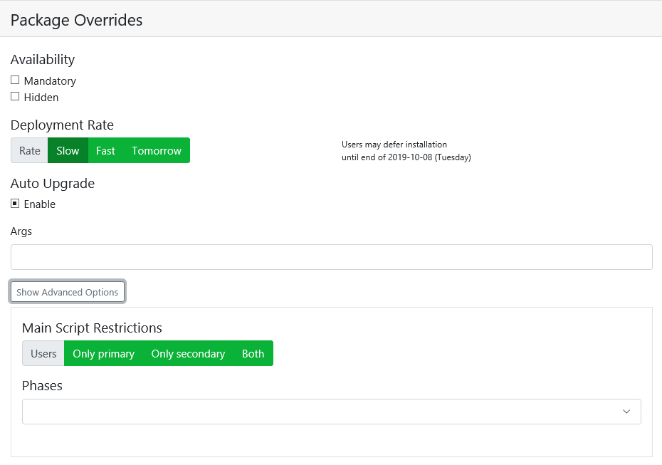
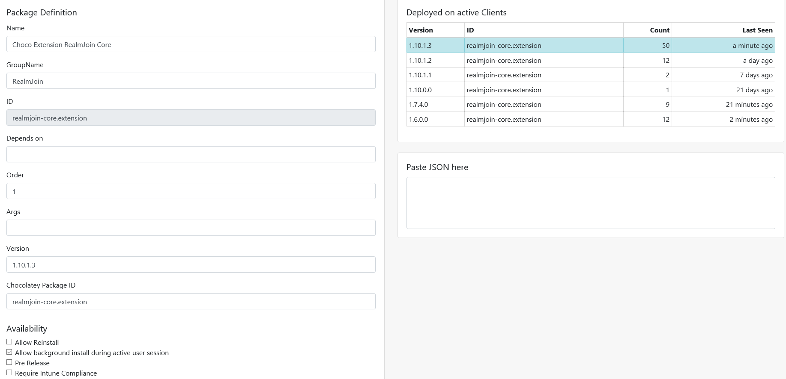
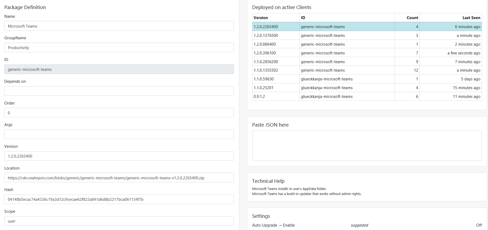

# Software Packages

This menu contains a list of all added software packages. Nine different attributes are displayed in this menu:

* Package **Type**
* Package **Name**
* Package **GroupName**
* **Upgradeability** of a package
* Package **Version**
* Package **Order**
* Dependencies ****\(**Dep**\) for a package
* Group \(**Gr**\) assignment
* User \(**Us**\) assignment

Above the attributes, there is a search bar \(**Search for ...**\). This search compares the input made with each of the attributes and returns suitable results. 

Next to the search box is the **Only Updates** checkbox. If you check this box, only the packages for which an update is available will be displayed. Next to it is another selection field: **Hide Organics**. If you check this box, all packages of type "Organic" will not be listed in the overview.

At the lower right end of the menu, you can browse through the pages manually.

### Package Assignment

If you click on a number in the **Gr** or **Us** fields, you will get a list of all RealmJoin groups and all RealmJoin users. In these lists, you can choose which groups or users should receive the software package.

#### Assign a Group / User

Click on a group/user of your choice to assign. You can now make the following settings:

<table>
  <thead>
    <tr>
      <th style="text-align:left">Setting</th>
      <th style="text-align:left">Explanation</th>
    </tr>
  </thead>
  <tbody>
    <tr>
      <td style="text-align:left"><b>Availability</b>
      </td>
      <td style="text-align:left">
        
<b>Mandatory:</b> The Packages are non-optional
           
        

        
<b>Hidden: </b>The Packages are invisible in the RealmJoin client context
          menu. This might be used for mandatory software or multiple level dependencies
          when the user should only be able to install the highest hierarchy and
          the underlying packages should be installed automatically.

      </td>
    </tr>
    <tr>
      <td style="text-align:left"><b>Deployment Rate</b>
      </td>
      <td style="text-align:left">Select the deployment rate. You have the choice between Slow, Fast and
        Tomorrow.</td>
    </tr>
    <tr>
      <td style="text-align:left"><b>Auto Upgrade</b>
      </td>
      <td style="text-align:left">With a tick at <b>Enable</b> you activate the automatic upgrade function</td>
    </tr>
    <tr>
      <td style="text-align:left"><b>Args</b>
      </td>
      <td style="text-align:left">
        
If the packaged software has to be installed with arguments. Make sure
          to use correct escaping. Usually arguments are in the form of:

        
<b>/Parameter1:value1 /Paramater2:&quot;value 2&quot;</b>
        

      </td>
    </tr>
    <tr>
      <td style="text-align:left"><b>Main Script Restrictions - Users</b>
      </td>
      <td style="text-align:left">This option allows a RealmJoin administrator to define whether this package
        should run for just the primary device user/group (default) or also/exclusively
        for secondary users.</td>
    </tr>
    <tr>
      <td style="text-align:left"><b>Main Script Restrictions - Phases</b>
      </td>
      <td style="text-align:left">This option allows a RealmJoin administrator to define whether this package
        should be run during the initial provisioning of the device or throughout
        other phases.</td>
    </tr>
  </tbody>
</table>### Package Definition - Chocolatey Package

To view details of a package and edit it, simply click on the name of a package. The following overview \(Package Definition\) will open:

There are different input fields on this page. Have a look at the table below for more details

<table>
  <thead>
    <tr>
      <th style="text-align:left">Input field</th>
      <th style="text-align:left">Explanation</th>
    </tr>
  </thead>
  <tbody>
    <tr>
      <td style="text-align:left"><b>Name</b>
      </td>
      <td style="text-align:left">The package is listed under this name of the client and the RealmJoin
        Admin Console.</td>
    </tr>
    <tr>
      <td style="text-align:left"><b>GroupName</b>
      </td>
      <td style="text-align:left">
        

        
An optional group name may be entered. This name has no connection to
          the user groups, instead it will be shown in the RealmJoin client context
          menu to group the depicted applications

      </td>
    </tr>
    <tr>
      <td style="text-align:left"><b>ID</b>
      </td>
      <td style="text-align:left">The RealmJoin internal name of the package, for example: realmjoin-core.extension</td>
    </tr>
    <tr>
      <td style="text-align:left"><b>Depends on</b>
      </td>
      <td style="text-align:left">
        
This option is used to indicate if a package needs another package to
          be installed to work properly. This may be the case for Office user setting
          packages, that require an office installation upfront.

        

        
For a working correlation, the correct package name has to be provided.
          Enter the package name into the following form: [&quot;PACKAGE NAME&quot;].
           
           If two or more packets need to be entered, separate the names with a comma.
          For example: [&quot;PACKAGE NAME1&quot;,&quot;PACKACKAGE NAME2&quot;]

      </td>
    </tr>
    <tr>
      <td style="text-align:left"><b>Order</b>
      </td>
      <td style="text-align:left">The order number is an Int32 type figure and provides RealmJoin with a
        basic structure to determine the package installation sequence. The lower
        the number the higher the importance, therefore a 10 will be installed
        before 100.
         
         It has to be noted that a 0 is translated to no sequence given and the
        order number is only taken into account at the first rollout.</td>
    </tr>
    <tr>
      <td style="text-align:left"><b>Args</b>
      </td>
      <td style="text-align:left">
        
If the packaged software has to be installed with arguments. Make sure
          to use correct escaping. Usually arguments are in the form of:

        
<b>/Parameter1:value1 /Paramater2:&quot;value 2&quot;</b>
        

        

        
Globally relevant parameters (e. g. volume license number) should be provided
          at the package addition step, while more individualized arguments (like
          language packs) are better specified during the assignment.

      </td>
    </tr>
    <tr>
      <td style="text-align:left"><b>Version</b>
      </td>
      <td style="text-align:left">The version of the package to be installed</td>
    </tr>
    <tr>
      <td style="text-align:left"><b>Chocolatey Package ID</b>
      </td>
      <td style="text-align:left">Exact Chocolatey repository name of the package to be installed. The combination
        of name and version is used to ensure that the correct package is installed.
        Usually, similar to the internal RealmJoin ID.</td>
    </tr>
    <tr>
      <td style="text-align:left"><b>Availability</b>
      </td>
      <td style="text-align:left">
        <ul>
          <li><b>Allow Reinstall</b>: This option allows the client user to reinstall
            and therefore override their current installation of the package.
             
          </li>
          <li><b>Allow Background Install</b>: The software package may be installed
            outside of the black screen installation, thus not blocking the access
            to the client&apos;s desktop and software.
             <b>Do not use this option for regular packages without discussion with your RealmJoin consultant!</b>
             
          </li>
          <li><b>Require Intune Compliance</b>: The package is installed as soon as
            RealmJoin is able to verify via the GraphAPI that the machine is considered
            compliant. This might stop the rollout for some time. The installation
            of the package and therefore all other mandatory packages with higher-order
            numbers that are queued to be installed afterwards is resumed when the
            client is compliant.</li>
        </ul>
      </td>
    </tr>
    <tr>
      <td style="text-align:left"><b>Deployment Rate</b>
      </td>
      <td style="text-align:left">Select the deployment rate. You have the choice between Slow, Fast and
        Tomorrow</td>
    </tr>
    <tr>
      <td style="text-align:left"><b>Auto Upgrade</b>
      </td>
      <td style="text-align:left">With a tick at <b>Enable</b> you activate the automatic upgrade function</td>
    </tr>
  </tbody>
</table>
Under normal circumstances, it is highly advised to prevent a normal user from having the same package assigned more than once.

To change the package Name or ID is not a proper way to edit assigned packages. Add a new package instead. Delete the obsolete one.

Do not use the dependency and order option on mandatory packages parallel. This might prevent the back-end from correctly resolve the order installation: During the initial rollout, or any rollout of mandatory packages after a login for this purpose, RealmJoin in the first step resolves all dependencies of the packages. If there are any, all packages which are listed as a dependency for a different package are installed. In the second step, the original packages are installed. This may cancel out any order numbers.

**For example:**

* Package A, order 1
* Package B, order 101and depending on Package C, order 100.
* If all packages are assigned as mandatory, the installation sequency will be C, A, B


#### Advanced Options

To access these options, press **Show Advanced Options** above Auto Upgrade. These are the available options:

| Setting | Explanation |
| :--- | :--- |
| **Includes User Script** | In the latest generation of packages, it is not necessary anymore to create a second package for the deployment of corresponding user settings, but such a script can be part of the main package. If this is the case, it will be run automatically if this option is checked. Parameters can be transferred via arguments as established. User scripts will not run for secondary users if the main application is not installed. |
| **Main Script Restrictions - Users** | This option allows a RealmJoin administrator to define whether this package should run for just the primary device user \(default\) or also/exclusively for secondary users. |
| **Main Script Restrictions - Phases** | This option allows a RealmJoin administrator to define whether this package should be run during the initial provisioning of the device or throughout other phases. |

#### Deployed on Active Client

This tile shows a list of active clients to which the package has already been distributed.

#### Paste JSON here

Instead of entering the name, version, order, args etc. manually, you can insert the JSON code of the package. You can find this code in the corresponding package repository.

### Package Definition - Craft Package

To view details of a package and edit it, simply click on the name of a package. The following overview \(Package Definition\) will open:

There are different input fields on this page. Have a look at the table below for more details

<table>
  <thead>
    <tr>
      <th style="text-align:left">Input field</th>
      <th style="text-align:left">Explanation</th>
    </tr>
  </thead>
  <tbody>
    <tr>
      <td style="text-align:left"><b>Name</b>
      </td>
      <td style="text-align:left">The package is listed under the name of the client and the RealmJoin Admin
        Console.</td>
    </tr>
    <tr>
      <td style="text-align:left"><b>GroupName</b>
      </td>
      <td style="text-align:left">
        

        
An optional group name may be entered. This name has no connection to
          the user groups, instead, it will be shown in the RealmJoin client context
          menu to group the depicted applications

      </td>
    </tr>
    <tr>
      <td style="text-align:left"><b>ID</b>
      </td>
      <td style="text-align:left">The RealmJoin internal name of the package; for example, realmjoin-core.extension</td>
    </tr>
    <tr>
      <td style="text-align:left"><b>Depends on</b>
      </td>
      <td style="text-align:left">
        
This option is used to indicate if a package needs another package to
          be installed to work properly. This may be the case for Office user setting
          packages, which requires an office installation upfront.

        

        
For a working correlation, the correct package name has to be provided.
          Enter the package name into the following form: [&quot;PACKAGE NAME&quot;].
           
           If two or more packets need to be entered, separate the names with a comma.
          For example: [&quot;PACKAGE NAME1&quot;,&quot;PACKACKAGE NAME2&quot;]

      </td>
    </tr>
    <tr>
      <td style="text-align:left"><b>Order</b>
      </td>
      <td style="text-align:left">The order number is an Int32 type figure and provides RealmJoin with a
        basic structure to determine the package installation sequence. The lower
        the number the higher the importance, therefore, a 10 will be installed
        before 100.
         
         It has to be noted that a 0 is translated to no sequence given and the
        order number is only taken into account at the first rollout.</td>
    </tr>
    <tr>
      <td style="text-align:left"><b>Args</b>
      </td>
      <td style="text-align:left">
        
If the packaged software has to be installed with arguments. Make sure
          to use correct escaping. Normally, arguments are in the form of:

        
<b>/Parameter1:value1 /Paramater2:&quot;value 2&quot;</b>
        

        

        
Globally relevant parameters (e. g. volume license number) should be provided
          at the package addition step, while more individualized arguments (like
          language packs) are better specified during the assignment.

      </td>
    </tr>
    <tr>
      <td style="text-align:left"><b>Version</b>
      </td>
      <td style="text-align:left">The version of the package to be installed</td>
    </tr>
    <tr>
      <td style="text-align:left"><b>Location</b>
      </td>
      <td style="text-align:left">Location of the package on the back-end</td>
    </tr>
    <tr>
      <td style="text-align:left"><b>Hash</b>
      </td>
      <td style="text-align:left">Hash of the package</td>
    </tr>
    <tr>
      <td style="text-align:left"><b>Scope</b>
      </td>
      <td style="text-align:left">Craft packages might be installed in the <b>user</b> or <b>system </b>scope</td>
    </tr>
    <tr>
      <td style="text-align:left"><b>Availability</b>
      </td>
      <td style="text-align:left">
        <ul>
          <li><b>Allow Reinstall</b>: This option allows the client user to reinstall
            and therefore override their current installation of the package.
             
          </li>
          <li><b>Allow Background Install</b>: The software package may be installed
            outside of the black screen installation, thus not blocking the access
            to the client&apos;s desktop and software.
             
          </li>
          <li><b>Require Intune Compliance</b>: The package is installed as soon as
            RealmJoin is able to verify via the GraphAPI that the machine is considered
            compliant. This might stop the rollout for some time. The installation
            of the package and therefore all other mandatory packages with higher-order
            numbers that are queued to be installed afterwards is resumed when the
            client is compliant.</li>
        </ul>
      </td>
    </tr>
    <tr>
      <td style="text-align:left"><b>Deployment Rate</b>
      </td>
      <td style="text-align:left">Select the deployment rate. You have the choice between Slow, Fast and
        Tomorrow</td>
    </tr>
    <tr>
      <td style="text-align:left"><b>Auto Upgrade</b>
      </td>
      <td style="text-align:left">With a click at <b>Enable</b> you activate the automatic upgrade function</td>
    </tr>
  </tbody>
</table>
Under normal circumstances, it is highly advised to prevent a normal user for having the same package assigned more than once.

To change package Name or ID is not a proper way to edit assigned packages. Add a new package instead. Delete the obsolete one.

Do not use the dependency and order option on mandatory packages parallel. This might prevent the back-end from correctly resolve the order installation: During the initial rollout, or any rollout of mandatory packages after a login for this purpose, RealmJoin in the first step resolves all dependencies of the packages. If there are any, all packages which are listed as a dependency for a different package are installed. In the second step, the original packages are installed. This may cancel out any order numbers.  
  
**For example:**

* Package A, order 1
* Package B, order 101 and depending on Package C, order 100.
* If all packages are assigned as mandatory, the installation sequence will be C, A, B


#### Advanced Options

To access these options, press **Show Advanced Options** above Auto Upgrade. These are the available options:

| Setting | Explanation |
| :--- | :--- |
| **Includes User Script** | In the latest generation of packages, it is not necessary anymore to create a second package for the deployment of corresponding user settings, but such a script can be part of the main package. If this is the case, it will be run automatically if this option is checked. Parameters can be transferred via arguments as established. User scripts will not run for secondary users if the main application is not installed. |
| **Main Script Restrictions - Users** | This option allows a RealmJoin administrator to define whether this package should run for just the primary device user \(default\) or also/exclusively for secondary users. |
| **Main Script Restrictions - Phases** | This options allows a RealmJoin administrator to define whether this package should be run during the initial provisioning of the device or througou other phases. |

#### Deployed on Active Client

This tile shows a list of active clients to which the package has already been distributed.

#### Paste JSON here

Instead of entering the name, version, order, args etc. manually, you can insert the JSON code of the package. You can find this code in the corresponding package repository.

#### Technical Help

In this tile, you will find technical help and information if you need further support.

#### Settings

### Add a Software Package

To add a Choco or Craft package, in the Software Packages overview, click one of the two green buttons in the upper right corner: +Add Choco or +Add Craft

You get an input mask \(like the one from Package Definition, but it is empty\).

### Duplicate a Package

Whenever a package with identical content is needed multiple times for the same user or group, the RealmJoin Portal offers the possibility to use the same package multiple times while preventing conflicting installations.

**A possible scenario:** One user group needs the same package with different arguments \(for example to map several network drives\) and the RealmJoin Client requires unique packages IDs.

To make the ID unique, a hash is written behind the ID and provided with a meaningful word/index, like **package-id\#Value**

### 

