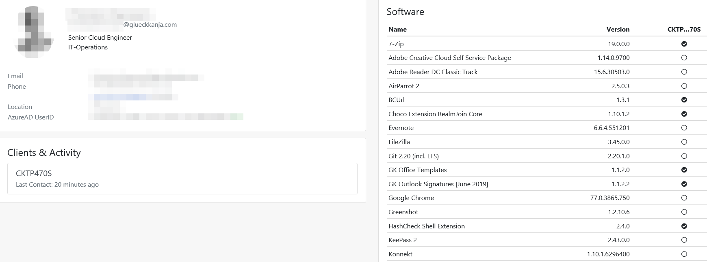
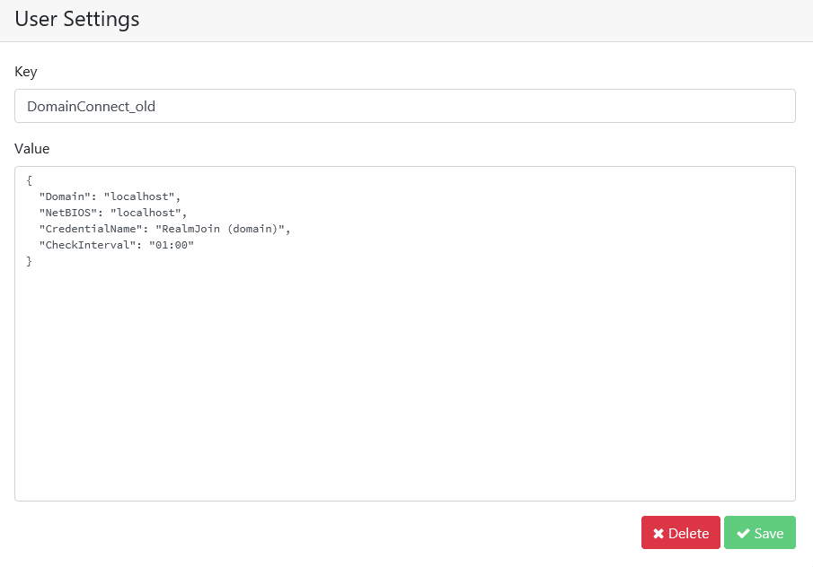

# Users and User Settings

### Users Menu

The Users menu gives you a list of all users assigned to the tenant. Eight different attributes are displayed:

* **Name** of the user
* User **ID**
* First-time registration in RealmJoin \(**First Seen**\)
* The **Last Contact** between the user and RealmJoin
* The sum of the group memberships \(**Gr**\)
* The number of installed packages \(**Pa**\)
* The number of clients \(**Cl**\)
* The sum of the settings \(**Se**\)

  
Above the attributes, there is a search bar \(**Search for ...**\). This search compares the input made with each of the attributes and returns suitable results. At the lower right end of the menu, you have the possibility to browse through the pages manually.

If you click on a number in **Gr, Pa, Cl or Se** fields you will get an overview of which group a user belongs to, which packages are installed, which clients the user is logged on to and which individual settings have been set for a user.


Users can not be added or assigned to groups using RealmJoin, the management of users and groups has to be done in Azure AD. Selecting a user opens up the users detail page, which contains information gathered by RealmJoin using the Microsoft Graph API.


#### User Details

To see details about a user, simply click on the name. An overview opens:

This submenu is divided into different tiles. The first tile contains the user's name, job title and contact details. The tile below lists the last activities of the user and which client was used.

The right tile shows which software \(name and version\) is available to the client and the current status. There are three different icons for the status:

* White circle = Available to user, but not installed
* Black circle and white hook = Up to date
* Black circle = Outdated but Auto-Upgrade not set

### User **S**ettings

The mentioned settings, which are assigned to users, can be checked and edited in the menu User Settings.

The listed settings are based on the JSON file format. JSON is described in our [JSON - Short Overview article](../packages/json-backgrounder.md). Username shows you which user has which setting. If a setting is listed several times, this means that it is set for several users.

Just click on a Key to edit it. An input mask appears:

In this mask you can enter a **Key** and a **Value**. Additionally, below the value field, you can enable or disable 'Ignore in VDI'. If you enable it, a user setting cannot be executed during a 'Virtual Desktop Infrastructure' \(VDI\) session.

Once your editing is complete, click **Save** to apply your changes. If you want to delete this setting, click **Delete**.

